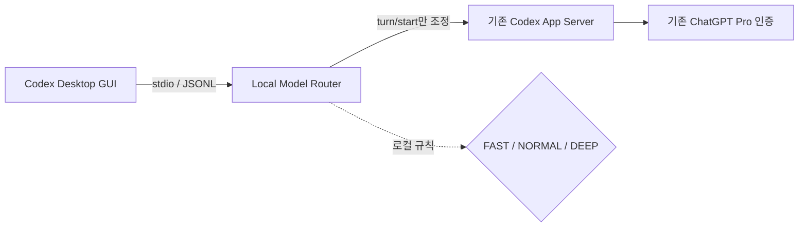

<p align="center">
  
</p>

<p align="center">
  <strong>작은 질문에 Astra를 태우지 마세요.</strong><br>
  Codex 기본 GUI는 그대로, 매 턴에 필요한 만큼의 모델과 reasoning effort만 자동으로 씁니다.
</p>

<p align="center">
  
  
  
  
  
</p>

---

# Codex Model Router

**Codex Model Router는 Codex Desktop용 로컬 토큰 절약기입니다.** 질문이 들어올 때마다 로컬 규칙으로 난도를 판정하고, 쉬운 일은 Luna, 보통 일은 Sol, 어려운 일은 Astra로 보냅니다. 분류를 위해 다른 LLM을 부르지 않으므로 **분류 토큰은 0**입니다.

```text
“JSON이 뭐야? 한 문장으로.”          → FAST   → Luna  / low
“이 함수 구현하고 테스트해.”         → NORMAL → Sol   / medium
“인증 구조를 위협 모델과 함께 설계해.” → DEEP   → Astra / high
```

> **목표:** 모든 질문을 최고 모델로 시작하는 낭비를 줄이면서, 어려운 작업에는 강한 모델을 남겨 두는 것.

## 왜 토큰을 크게 아낄 수 있나

모든 턴을 Astra/Ultra로 보내면 한 문장 설명, 파일명 찾기, 간단한 수정도 가장 비싼 경로를 탑니다. Router는 실제 작업을 시작하기 전에 무료 로컬 분류를 거칩니다.

| 경로 | 쓰임 | 모델 / effort | 공개 token rate 기준 Astra 대비* |
|---|---|---|---:|
| ⚡ **FAST** | 짧은 설명·조회·추출·정리 | Luna / low | input 약 **98%↓**, output 약 **97.6%↓** |
| 🛠️ **NORMAL** | 일반 질문·구현·테스트 | Sol / medium | input/output 약 **60%↓** |
| 🧠 **DEEP** | 복잡한 설계·깊은 디버깅·중요 검토 | Astra / high | 품질 우선 |

\* 모델별 공개 token-based credit rate의 단순 비율입니다. 실제 절감률은 캐시, reasoning token, 대화 길이, 오분류와 재작업에 따라 달라집니다. 이 프로젝트는 절감액을 보장하지 않으며 GUI 푸터에 항상 **추정**으로 표시합니다.

**절약 포인트는 세 가지입니다.**

- 분류용 API 호출 **0회**
- 자동 경로에서 Ultra 사용 **0회**
- 별도 API 키·별도 API 과금 **없음** — 기존 ChatGPT Pro 로그인을 그대로 사용

## Codex GUI를 그대로 씁니다



설치된 Codex 앱 파일을 패치하지 않습니다. Router는 실제 `codex.exe app-server`를 자식 프로세스로 실행하고 JSONL을 양방향 중계합니다. 로그인, thread, streaming, tool call, 승인, 파일 변경은 기존 App Server가 계속 처리합니다.

## 3분 시작

### 요구 사항

- Windows 11
- 설치 및 로그인된 Codex Desktop
- Python 3
- 저장소 경로에서 PowerShell 실행

### 1. 내려받기

```powershell
git clone https://github.com/dsaka2wip-cpu/Codex-Model-Router.git
Set-Location .\Codex-Model-Router
```

### 2. 빌드 및 사전 검사

```powershell
.\Build-NativeRouter.ps1
.\Start-AdaptiveCodex.ps1 -CheckOnly
```

### 3. Codex 연결

Codex를 완전히 종료한 뒤 **`Start Adaptive Codex.cmd`**를 더블클릭하거나 실행합니다.

```powershell
.\Start-AdaptiveCodex.ps1
```

이미 실행 중인 Codex에는 중간 삽입할 수 없습니다. 실행기가 새 Codex 프로세스에만 `CODEX_CLI_PATH`를 전달하며 사용자·시스템 전역 환경변수는 바꾸지 않습니다.

### 즉시 원복

Codex를 완전히 종료한 뒤 **`Restore Codex.cmd`**를 더블클릭하거나 실행합니다.

```powershell
.\Restore-Codex.ps1
```

원복은 Router를 거치지 않고 기존 Codex를 시작합니다. 앱, 설정, 로그인, 대화 데이터는 삭제하지 않습니다.

## 매 턴 무엇을 썼는지 보여줍니다

최종 답변과 Plan 결과 끝에 로컬 푸터를 붙입니다.

```text
Router · 이번 턴: FAST → Luna / Low · 직전 턴: NORMAL → Sol / Medium
세션 17턴 · Luna 9 / Sol 6 / Astra 2 · 사용량 절감 추정 63%
```

집계는 현재 Router 프로세스의 해당 thread 기준입니다. 실제 token usage가 있으면 공개 credit rate로 계산하고, 없으면 공개 평균 local message 값을 사용합니다. 푸터는 로컬 GUI 방향에만 추가하므로 서버의 대화 원문은 바꾸지 않으며 앱을 다시 로드하면 사라질 수 있습니다.

## 자동보다 내 선택이 우선

현재 Codex 프로토콜은 GUI 기본값과 사용자가 방금 명시적으로 고른 값을 신뢰성 있게 구별하지 못합니다. 그래서 질문 첫 줄의 명시적 제어문을 우선합니다.

| 질문 첫 줄 | 동작 |
|---|---|
| `[router auto]` | 모델과 effort 모두 자동 |
| `[router off]` | GUI가 보낸 값 그대로 사용 |
| `[router tier=deep]` | 이번 턴만 DEEP |
| `[router model=gui effort=auto]` | 모델은 GUI, effort만 자동 |
| `[router model=sol effort=high]` | 모델과 effort 직접 지정 |

기존 `/model astra high` 형식도 지원합니다. Plan mode의 `collaborationMode.settings.model`과 `reasoning_effort`도 함께 처리합니다. 같은 thread 안에서 모델이 바뀌어도 대화 맥락은 유지됩니다.

## 안전하게 실패합니다

- 파싱 실패, 알 수 없는 모델 조합, API key 인증, 다른 provider에서는 원래 요청을 보존합니다.
- 프롬프트, 응답, 인증 토큰, API 키, tool 인수, 명령, 파일 diff를 Router 로그에 저장하지 않습니다.
- 서버 stderr는 GUI로 전달할 뿐 별도 수집하지 않습니다.
- 네트워크 실패나 거절된 요청을 자동 재전송하지 않습니다.
- Router가 죽으면 연결도 끊어지므로 Codex를 닫고 원복 실행기로 다시 시작합니다.

## 현재 검증 상태

Windows 11, Codex CLI `0.153.4`, Codex Desktop `26.903.8094.0`에서 확인했습니다.

| 검증 | 결과 |
|---|---|
| 오프라인 단위·프로토콜 검사 | ✅ 48개 통과 |
| 실제 GUI → Router → App Server 프로세스 경로 | ✅ 확인 |
| 기존 ChatGPT Pro 인증 및 기존 대화 유지 | ✅ 확인 |
| GUI 첫 NORMAL 턴 → Sol/medium | ✅ 요청 route와 서버 settings 일치 |
| 독립 App Server에서 Luna → Sol, 같은 thread 문맥 | ✅ 확인 |
| Plan nested settings와 streaming | ✅ 확인 |
| 명시적 GUI 값 보존 (`[router off]`) | ✅ 확인 |
| tool/command 승인 흐름 | ✅ 현재 작업에서 정상 |
| 새 푸터의 실제 GUI 렌더링 | ⏳ 오프라인 검증 완료, GUI 재시작 검증 대기 |
| 실제 GUI 원복 전체 흐름 | ⏳ 스크립트 구현, 수동 재시작 검증 대기 |

### GUI의 “모델이 변경되었습니다” 표시에 관하여

턴 위의 `Astra에서 Astra로 모델이 변경되었습니다` 같은 문구와 하단 피커는 실제 실행 결과가 아닐 수 있습니다. 현재 앱이 다음 턴의 GUI 선택값으로 미리 만드는 표시이며, `turn/started` 응답에는 실제 실행 model/effort가 없습니다. 앱 자체를 패치하거나 가짜 서버 알림을 만들지 않고는 이 문구를 실제 라우팅값으로 안전하게 교체할 수 없어 Router 푸터를 별도로 제공합니다.

## 설정

`state/adaptive-config.json`에서 모델과 effort를 독립적으로 설정할 수 있습니다. 값은 턴마다 다시 읽으며 파일이 없거나 잘못되면 원래 요청을 보냅니다.

```json
{
  "model": "auto",
  "effort": "auto",
  "tiers": {
    "fast":   { "model": "gpt-5.6-luna", "effort": "low" },
    "normal": { "model": "gpt-5.6-sol",  "effort": "medium" },
    "deep":   { "model": "gpt-6-astra",  "effort": "high" }
  }
}
```

`state/`, 로그, 백업, 핸드오프, 실제 검사 결과는 Git에서 제외됩니다.

## 테스트

추가 패키지 없이 Python 표준 라이브러리만 사용합니다.

```powershell
python -m unittest -q
```

실제 구독 사용량이 발생하는 검사는 자동 실행하지 않습니다.

```powershell
python live_native_check.py
python live_native_check.py --plan-only
```

## Windows Smart App Control

로컬에서 빌드한 `AdaptiveCodexRouter.exe`는 서명되지 않았습니다. Smart App Control이 켜진 PC에서는 차단될 수 있으며 파일 하나만 허용하는 관리자 예외는 제공되지 않습니다. 지원되는 배포 경로는 신뢰된 공급자의 RSA 코드서명 인증서로 최종 실행 파일을 서명하는 것입니다. 보안 기능을 끄는 자동화나 자체서명 인증서 등록을 제공하지 않습니다.

## 함께 들어 있는 도구

이 저장소의 중심은 **기본 GUI stdio Router**입니다. 초기 실험에서 만든 두 경로도 함께 보존합니다.

- `Start Router.cmd`: 별도 localhost 입력 UI
- `router.py`, `install.py`, `manage.py`: 하위 에이전트 모델 라우팅 훅

두 도구는 기본 GUI 메인 턴 Router와 적용 범위가 다릅니다.

## 근거와 참고

- [Codex App Server 프로토콜](https://learn.chatgpt.com/docs/app-server)
- [Codex 인증 모드](https://learn.chatgpt.com/docs/app-server#authentication-modes)
- [Codex hooks](https://learn.chatgpt.com/docs/hooks)
- [OpenAI Codex 요금·사용량·token-based rate](https://learn.chatgpt.com/docs/pricing)
- README 구성 영감: [Ponytail](https://github.com/DietrichGebert/ponytail)

---

<p align="center">
  <strong>쉬운 일은 가볍게. 어려운 일은 제대로.</strong><br>
  Codex Model Router — spend intelligence where it matters.
</p>
