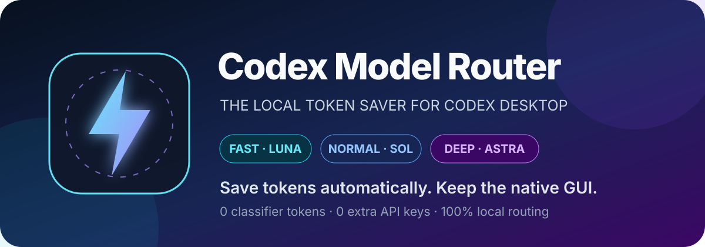
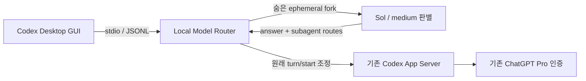

<p align="center">
  
</p>

<p align="center">
  <strong>작은 질문에 Astra를 태우지 마세요.</strong><br>
  Codex 기본 GUI는 그대로, 매 턴에 필요한 만큼의 모델과 reasoning effort만 자동으로 씁니다.
</p>

<p align="center">
  
  
  
  
  
</p>

---

# Codex Model Router

**Codex Model Router는 Codex Desktop용 적응형 토큰 절약기입니다.** 질문이 들어오면 고정된 **GPT-5.6 Sol / medium 판별기**가 기존 대화 문맥과 새 요청을 먼저 읽고, 설치된 모델 카탈로그 안에서 실제 답변의 model과 reasoning effort를 각각 고릅니다. 병렬화할 가치가 있는 작업은 최대 3개의 하위 작업 경로도 함께 정합니다.

```text
“값 하나를 정확히 추출해.”           → Luna  / high
“이 함수 구현하고 테스트해.”         → Terra / medium
“복잡한 인증 장애의 원인을 추적해.”    → Sol   / high
“핵심 시스템을 실패 비용까지 설계해.”  → Astra / ultra
```

> **목표:** 모든 질문을 최고 모델로 시작하는 낭비를 줄이면서, 어려운 작업에는 강한 모델을 남겨 두는 것.

## 왜 토큰을 크게 아낄 수 있나

모든 턴을 Astra/Ultra로 보내면 한 문장 설명, 파일명 찾기, 간단한 수정도 가장 비싼 경로를 탑니다. Router는 실제 작업 전에 Sol/medium으로 짧은 판별 턴을 한 번 실행하고, 더 저렴한 모델로 충분한 요청만 낮춥니다.

| 모델 | 주 용도 | 선택 가능한 effort | 공개 token rate 기준 Astra 대비* |
|---|---|---|---:|
| ⚡ **Luna** | 좁고 명확한 조회·추출·반복 작업 | low, medium, high, xhigh, max (**5**) | input 약 **98%↓**, output 약 **97.6%↓** |
| 🔧 **Terra** | 일상적인 제작·분석·범위가 분명한 구현 | low, medium, high, xhigh, max, ultra (**6**) | input **80%↓**, output **76%↓** |
| 🛠️ **Sol** | 모호하거나 여러 단계인 구현·연구·보안 | low, medium, high, xhigh, max, ultra (**6**) | input/output 약 **60%↓** |
| 🧠 **Astra** | 가장 어려운 설계·깊은 디버깅·고비용 실패 검토 | low, medium, high, xhigh, max, ultra (**6**) | 품질 우선 |

\* 표는 답변 모델 자체의 공개 token-based credit rate를 단순 비교한 값입니다. 실제 푸터 계산에는 **Sol/medium 판별 턴의 사용량도 포함**합니다. 실제 절감률은 캐시, reasoning token, 대화 길이, 판별과 재작업에 따라 달라지며 절감액을 보장하지 않습니다.

**설계의 핵심은 세 가지입니다.**

- 판별기는 매번 동일한 **Sol / medium**이라 비용과 품질 기준이 일정
- 답변 모델과 effort는 독립 선택 — 현재 확인된 **23개 조합** 전체를 실제 `model/list` 카탈로그에서 동적으로 사용
- `FAST/NORMAL/DEEP`는 표시·수동 강제용 요약 라벨이며, LLM 판별기는 이 등급을 거치지 않고 model·effort를 바로 선택
- 별도 API 키·별도 API 과금 **없음** — 기존 ChatGPT Pro 로그인을 그대로 사용

판별 때문에 매 질문마다 모델 호출이 한 번 추가되므로 응답 시작은 느려지고 사용량도 생깁니다. 대신 단순 키워드 규칙보다 문맥과 실패 위험을 잘 판단해 첫 결과의 품질을 높이는 쪽을 택했습니다.

## Codex GUI를 그대로 씁니다



설치된 Codex 앱 파일을 패치하지 않습니다. Router는 실제 `codex.exe app-server`를 자식 프로세스로 실행하고 JSONL을 양방향 중계합니다. 판별은 원래 thread의 문맥을 상속하는 메모리 내 fork에서 실행되고 완료 즉시 삭제됩니다. 현재 작업의 writer lock 때문에 fork가 거부되면, 같은 App Server에서 최근 사용자·최종 답변 텍스트만 읽어 격리된 ephemeral 판별 thread에 전달합니다. 두 경로 모두 읽기 전용·네트워크 차단·승인 없음으로 실행합니다. 로그인, 원래 thread, streaming, tool call, 승인, 파일 변경은 기존 App Server가 계속 처리합니다.

## 하위 작업도 따로 맞춥니다

같은 Sol/medium 판별 결과에는 독립 하위 작업 **0~3개**와 각 작업의 model·effort가 포함됩니다. 메인 에이전트는 계획이 실제로 독립적일 때 `fork_turns=none`으로 동시에 실행합니다. Luna/high, Terra/medium, Sol/xhigh, Astra/ultra처럼 하위 작업마다 서로 다른 조합을 쓸 수 있습니다.

단순 확인이나 순차 작업에는 하위 에이전트를 만들지 않습니다. 하위 에이전트는 별도 스레드에서 병렬로 도는 작업이므로 완료 시간과 메인 문맥 오염을 줄일 수 있지만, 각각 토큰을 사용해 단일 에이전트 실행보다 총토큰은 늘 수 있습니다. 이 기능은 토큰 절약보다 **처리 시간과 결과 품질**을 위한 선택적 병렬화입니다.

## 3분 시작

### 요구 사항

- Windows 11
- 설치 및 로그인된 Codex Desktop
- Python 3
- 저장소 경로에서 PowerShell 실행

### 1. 내려받기

```powershell
git clone https://github.com/dsaka2wip-cpu/Codex-Model-Router.git
Set-Location .\Codex-Model-Router
```

### 2. 빌드 및 사전 검사

```powershell
.\Build-NativeRouter.ps1
.\Start-AdaptiveCodex.ps1 -CheckOnly
```

### 3. Codex 연결

Codex를 완전히 종료한 뒤 **`Start Adaptive Codex.cmd` (Codex가 실행 중이면 완전히 종료될 때까지 기다렸다가 새 Router로 자동 실행)**를 더블클릭하거나 실행합니다.

```powershell
.\Start-AdaptiveCodex.ps1
```

이미 실행 중인 Codex에는 중간 삽입할 수 없습니다. 실행기가 새 Codex 프로세스에만 `CODEX_CLI_PATH`를 전달하며 사용자·시스템 전역 환경변수는 바꾸지 않습니다.

### 즉시 원복

Codex를 완전히 종료한 뒤 **`Restore Codex.cmd`**를 더블클릭하거나 실행합니다.

```powershell
.\Restore-Codex.ps1
```

원복은 Router를 거치지 않고 기존 Codex를 시작합니다. 앱, 설정, 로그인, 대화 데이터는 삭제하지 않습니다.

## 매 턴 무엇을 썼는지 보여줍니다

최종 답변과 Plan 결과 끝에 로컬 푸터를 붙입니다.

```text
Router · 판별: Sol / Medium · 이번 턴: FAST: Luna / High · 직전 턴: NORMAL: Terra / Medium
세션 17턴 · Luna 7 / Terra 4 / Sol 4 / Astra 2 · 사용량 절감 추정 51%
```

집계는 현재 Router 프로세스의 해당 thread 기준입니다. 답변과 판별의 실제 token usage가 있으면 공개 credit rate로 계산하고, 없으면 평균값 기반 추정치를 사용합니다. 푸터는 로컬 GUI 방향에만 추가하므로 서버의 대화 원문은 바꾸지 않으며 앱을 다시 로드하면 사라질 수 있습니다.

## 자동보다 내 선택이 우선

현재 Codex 프로토콜은 GUI 기본값과 사용자가 방금 명시적으로 고른 값을 신뢰성 있게 구별하지 못합니다. 그래서 질문 첫 줄의 명시적 제어문을 우선합니다.

| 질문 첫 줄 | 동작 |
|---|---|
| `[router auto]` | 모델과 effort 모두 자동 |
| `[router off]` | GUI가 보낸 값 그대로 사용 |
| `[router tier=deep]` | 이번 턴만 DEEP |
| `[router model=gui effort=auto]` | 모델은 GUI, effort만 자동 |
| `[router model=sol effort=high]` | 모델과 effort 직접 지정 |

기존 `/model astra high` 형식도 지원합니다. Plan mode의 `collaborationMode.settings.model`과 `reasoning_effort`도 함께 처리합니다. 같은 thread 안에서 모델이 바뀌어도 대화 맥락은 유지됩니다.

자동 라우팅 턴이 끝나면 Router가 thread의 다음 턴 기본값을 **Sol / medium**으로 되돌립니다. 그래서 어려운 턴에 사용한 Sol/Extra High나 Astra가 입력창 프리셋에 남지 않습니다. `[router off]`로 GUI 값을 그대로 사용한 턴은 자동 복구하지 않습니다.

## 안전하게 실패합니다

- 파싱 실패, 알 수 없는 모델 조합, API key 인증, 다른 provider에서는 원래 요청을 보존합니다.
- 프롬프트, 응답, 인증 토큰, API 키, tool 인수, 명령, 파일 diff를 Router 로그에 저장하지 않습니다.
- 판별 로그에는 조정에 필요한 시간·토큰 수와 제한된 실패 유형만 숫자/분류값으로 기록합니다.
- 판별 입력은 현재 요청 원문, 최근 3턴 최대 4,000자, 메모리 내 작업 상태 최대 1,200자로 제한합니다.
- 작업 상태 요약은 같은 Sol/medium 판별 응답에서 함께 만들며 디스크에 저장하지 않습니다. 앱을 다시 시작하면 최근 문맥에서 다시 구성합니다.
- 판별은 동일한 `codex.exe`와 ChatGPT 인증을 공유하는 경량 App Server sidecar에서 실행하며, 프로젝트 지침·스킬·플러그인·MCP·실행 도구를 비활성화합니다.
- 서버 stderr는 GUI로 전달할 뿐 별도 수집하지 않습니다.
- 네트워크 실패나 거절된 요청을 자동 재전송하지 않습니다.
- Router가 죽으면 연결도 끊어지므로 Codex를 닫고 원복 실행기로 다시 시작합니다.

## 현재 검증 상태

Windows 11, Codex CLI `0.153.4`, Codex Desktop `26.903.8094.0`에서 확인했습니다.

| 검증 | 결과 |
|---|---|
| 오프라인 단위·프로토콜 검사 | ✅ 58개 통과 |
| 판별 시간·토큰·fallback 유형의 비민감 계측 | ✅ 정책·프로토콜 검사 통과 |
| 숨은 ephemeral fork·판별 이벤트 차단·동시 GUI 이벤트 | ✅ 모의 App Server에서 확인 |
| Luna/high·Terra/max·Astra/ultra 독립 선택 | ✅ 정책 검사 통과 |
| Sol/medium 하위 작업 계획·모델/effort 다양화 | ✅ 정책·프로토콜 검사 통과 |
| 실제 GUI → Router → App Server 프로세스 경로 | ✅ 확인 |
| 실제 GUI 경량 판별 sidecar | ✅ 32,447 → 7,207 tokens (약 78% 감소) |
| 기존 ChatGPT Pro 인증 및 기존 대화 유지 | ✅ 확인 |
| GUI 첫 NORMAL 턴 → Sol/medium | ✅ 요청 route와 서버 settings 일치 |
| 23개 후보를 제시한 실제 GUI 판별 1건 → Sol/high | ✅ 요청 route와 서버 settings 일치 |
| 독립 App Server에서 Luna → Sol, 같은 thread 문맥 | ✅ 확인 |
| Plan nested settings와 결과 전달 | ✅ 실제 GUI에서 Sol/high route·nested settings·완료 결과 확인 |
| 명시적 GUI 값 보존 (`[router off]`) | ✅ 확인 |
| tool/command 승인 흐름 | ✅ 현재 작업에서 정상 |
| 새 푸터의 실제 GUI 렌더링 | ✅ `DEEP: Sol / High` 형식과 사용량 추정 표시 확인 |
| 자동 턴 완료 후 Sol/medium 유휴 프리셋 복구 | ✅ 정책·stdio RPC 및 실제 GUI 재시작 확인 |
| Router 종료·App Server 재연결·기존 thread 유지 | ✅ 실제 백엔드 10/10 통과 |
| 실제 GUI 원복 전체 흐름 | ⏳ 스크립트 구현, 수동 재시작 검증 대기 |

## 라우팅 평가

`classifier_eval.py`는 12개의 합성·비민감 사례로 실제 Sol/medium 판별기의 선택 범위와 판별 비용을 확인합니다. 기본 실행은 앞의 6개 canary만 사용하며, `--run` 없이는 모델을 호출하지 않습니다.

```powershell
python .\classifier_eval.py --run
python .\classifier_eval.py --run --limit 12
```

실행 환경의 Codex CLI에 ChatGPT 인증이 있어야 합니다. Desktop이 App Server에만 주입한 인증은 일반 터미널에 전달되지 않을 수 있으며, 이 경우 평가기는 `RuntimeError` 유형만 표시하고 호출 전에 중단합니다.

결과는 Git에서 제외된 `state/classifier-eval-latest.json`에 사례 ID, model/effort, 하위 작업 역할·수, 시간·토큰 숫자만 저장합니다. 프롬프트·응답·오류 원문은 저장하지 않습니다. 이 평가는 라우팅 적합성과 판별 사용량을 측정하며, 실제 작업 결과물의 품질이나 ChatGPT Pro의 금전 비용을 뜻하지 않습니다.

### GUI의 “모델이 변경되었습니다” 표시에 관하여

턴 위의 `Astra에서 Astra로 모델이 변경되었습니다` 같은 문구와 하단 피커는 실제 실행 결과가 아닐 수 있습니다. 현재 앱이 다음 턴의 GUI 선택값으로 미리 만드는 표시이며, `turn/started` 응답에는 실제 실행 model/effort가 없습니다. 앱 자체를 패치하거나 가짜 서버 알림을 만들지 않고는 이 문구를 실제 라우팅값으로 안전하게 교체할 수 없어 Router 푸터를 별도로 제공합니다.

## 설정

`state/adaptive-config.json`에서 판별 모델과 답변 모델·effort를 독립적으로 설정할 수 있습니다. 값은 턴마다 다시 읽으며 파일이 없거나 잘못되면 원래 요청을 보냅니다.

```json
{
  "model": "auto",
  "effort": "auto",
  "classifier": { "model": "gpt-5.6-sol", "effort": "medium" },
  "tiers": {
    "FAST":   { "model": "gpt-5.6-luna", "effort": "low" },
    "NORMAL": { "model": "gpt-5.6-sol",  "effort": "medium" },
    "DEEP":   { "model": "gpt-6-astra",  "effort": "high" }
  }
}
```

`state/`, 로그, 백업, 핸드오프, 실제 검사 결과는 Git에서 제외됩니다.

## 테스트

추가 패키지 없이 Python 표준 라이브러리만 사용합니다.

```powershell
python -m unittest -q
```

실제 구독 사용량이 발생하는 검사는 자동 실행하지 않습니다.

```powershell
python live_native_check.py
python live_native_check.py --plan-only
```

## Windows Smart App Control

로컬에서 빌드한 `AdaptiveCodexRouter.exe`는 서명되지 않았습니다. Smart App Control이 켜진 PC에서는 차단될 수 있으며 파일 하나만 허용하는 관리자 예외는 제공되지 않습니다. 지원되는 배포 경로는 신뢰된 공급자의 RSA 코드서명 인증서로 최종 실행 파일을 서명하는 것입니다. 보안 기능을 끄는 자동화나 자체서명 인증서 등록을 제공하지 않습니다.

## 함께 들어 있는 도구

이 저장소의 중심은 **기본 GUI stdio Router**입니다. 초기 실험에서 만든 두 경로도 함께 보존합니다.

- `Start Router.cmd`: 별도 localhost 입력 UI
- `router.py`, `install.py`, `manage.py`: 하위 에이전트 모델 라우팅 훅

두 도구는 기본 GUI 메인 턴 Router와 적용 범위가 다릅니다.

## 근거와 참고

- [Codex App Server 프로토콜](https://learn.chatgpt.com/docs/app-server)
- [Codex 인증 모드](https://learn.chatgpt.com/docs/app-server#authentication-modes)
- [Codex hooks](https://learn.chatgpt.com/docs/hooks)
- [OpenAI Codex 요금·사용량·token-based rate](https://learn.chatgpt.com/docs/pricing)
- README 구성 영감: [Ponytail](https://github.com/DietrichGebert/ponytail)

---

<p align="center">
  <strong>쉬운 일은 가볍게. 어려운 일은 제대로.</strong><br>
  Codex Model Router — spend intelligence where it matters.
</p>
